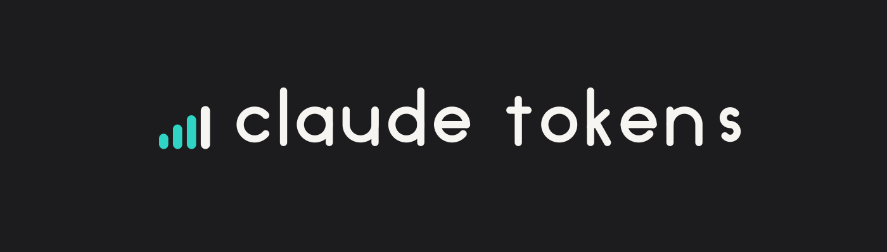
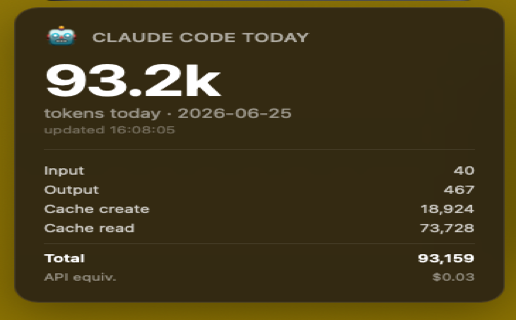

<!-- BANNER: uncomment once design/github/readme-banner-{light,dark}-1400x400.png exist.
<p align="center">
  <picture>
    <source media="(prefers-color-scheme: dark)"  srcset="design/github/readme-banner-dark-1400x400.png">
    <source media="(prefers-color-scheme: light)" srcset="design/github/readme-banner-light-1400x400.png">
    
  </picture>
</p>
-->

<h1 align="center">uebersicht-claude-tokens</h1>

<p align="center"><b>An Ubersicht widget showing daily Claude Code token usage as a desktop tile on macOS.</b></p>

<p align="center">
  
  
  
  
  <a href="LICENSE"></a>
</p>

## What it does

- Shows today's Claude Code token total on the desktop, formatted with k and M suffixes.
- Breaks the total into input, output, cache create, and cache read.
- Shows the API-pricing equivalent of that usage.
- Refreshes every 30 seconds without any network call.

## Features

- **Desktop tile.** Renders through Ubersicht, always visible, never in the way.
- **Full token breakdown.** Input, output, cache create, cache read, and total.
- **Cost equivalent.** ccusage's API-pricing figure for the same usage.
- **Last update time** shown under the total.
- **Configurable display.** Pin to a specific monitor by replacing `display: 'main'` with the function form.
- **Configurable position.** Edit `bottom:` and `left:` in the `style:` block.
- **Configurable refresh.** 30 seconds by default.
- **No credentials.** ccusage reads Claude Code's local JSONL logs; the widget makes no network calls and needs no API key.

## Stack

- Widget: CoffeeScript, rendered by [Ubersicht](http://tracesof.net/uebersicht/)
- Usage data: [ccusage](https://github.com/ryoppippi/ccusage)
- JSON handling: jq

## Install

Requires: Ubersicht, ccusage, jq.

```bash
brew install ccusage jq
git clone https://github.com/ShashankKarpal/uebersicht-claude-tokens.git
cp -r uebersicht-claude-tokens/claude-tokens.widget ~/Library/Application\ Support/Übersicht/widgets/
```

Click the Ubersicht menu bar icon and choose Refresh all.

## Usage



The tile appears on the desktop and updates itself. No interaction needed.

## Project structure

```
claude-tokens.widget/     the widget (index.coffee)
claude-tokens.widget.zip  packaged widget for the Ubersicht gallery
widget.json               gallery manifest
design/                   brand assets, screenshot
```

## Note on cost

The cost figure is ccusage's API-pricing equivalent of your usage. It is not a bill. Claude Code subscriptions cover this usage; the number is for awareness.

## Compatibility

Apple Silicon, macOS 14 or later. Works on any Mac that runs Ubersicht.

## License

MIT. See [LICENSE](LICENSE).

## Author

Built by Shashank Karpal.

> Built with Claude (Anthropic) as a debugging partner. Design, decisions, and final review were the author's.
