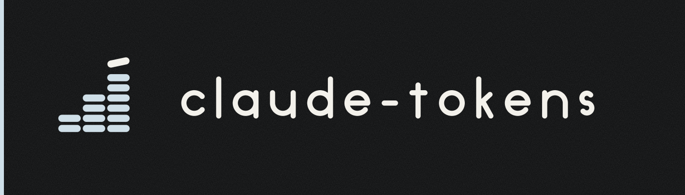

<p align="center">
  <picture>
    <source media="(prefers-color-scheme: dark)"  srcset="design/github/readme-banner-dark.svg">
    <source media="(prefers-color-scheme: light)" srcset="design/github/readme-banner-light.svg">
    
  </picture>
</p>

<h1 align="center">claude-tokens</h1>

<p align="center"><b>An Ubersicht widget showing daily Claude Code token usage as a desktop tile on macOS.</b></p>

<p align="center">
  
  
  
  
  <a href="LICENSE"></a>
</p>

## What it does

- Shows today's Claude Code token total on the desktop, formatted with k and M suffixes. Claude Code only: ccusage also detects other coding agents (Codex CLI and friends), and those are deliberately left out of this tile.
- Breaks the total into input, output, cache create, and cache read.
- Shows the API-pricing equivalent of that usage.
- Refreshes every 30 seconds. No network call: ccusage runs in offline mode and prices from its bundled table.

## Features

- **Desktop tile.** Renders through Ubersicht, always visible, never in the way.
- **Full token breakdown.** Input, output, cache create, cache read, and total.
- **Cost equivalent.** ccusage's API-pricing figure for the same usage.
- **Last update time** shown under the total.
- **Configurable display.** Pin to a specific monitor by replacing `display: 'main'` with the function form.
- **Configurable position.** Edit `bottom:` and `left:` in the `style:` block.
- **Configurable refresh.** 30 seconds by default.
- **No credentials, no network.** ccusage reads Claude Code's local JSONL logs and runs with `--offline`, so nothing leaves the machine and the tick never waits on a fetch. The cost line uses the pricing table bundled with your ccusage version; upgrade ccusage to pick up new models.

## Stack

- Widget: CoffeeScript, rendered by [Ubersicht](http://tracesof.net/uebersicht/)
- Usage data: [ccusage](https://github.com/ryoppippi/ccusage)
- JSON handling: jq

## Install

Requires: Ubersicht, ccusage, jq.

```bash
brew install ccusage jq
git clone https://github.com/ShashankKarpal/claude-tokens.git
cp -r claude-tokens/claude-tokens.widget ~/Library/Application\ Support/Übersicht/widgets/
```

Click the Ubersicht menu bar icon and choose Refresh all.

## Usage


The tile appears on the desktop and updates itself. No interaction needed.

## Project structure

```
claude-tokens.widget/     the widget (index.coffee)
claude-tokens.widget.zip  packaged widget for the Ubersicht gallery
bin/ccusage-today.sh      the extractor, one JSON line; the widget embeds the same body
tests/selftest.sh         parity, output states, cache (bash tests/selftest.sh)
widget.json               gallery manifest
design/                   brand assets, tokens, BRAND.md
```

## Using the same number elsewhere

`bin/ccusage-today.sh` prints today's figures as one JSON object (`status` is `ok`, `empty`, or `error`). A menu bar tile or any other script can call it instead of running ccusage again: consumers polling every 30 seconds share one ccusage call through a small per-user cache file (20 seconds of freshness, keyed by day, owner-only, never caches an error). The widget stays a single self-contained file, so it carries a verbatim copy of the script body; CI and the selftest diff the two and fail on drift. Set `CLAUDE_TOKENS_CACHE_DIR` to move the cache.

## Optional: plan ROI line

Put the monthly price of your Claude subscription, as one number, in `~/.config/claude-tokens/plan-usd-month` (for example `200`). The tile then adds a row such as `Plan ROI  18.5% of $6.67/day`: today's API-equivalent cost as a share of what one day of the plan costs (30-day month). No file, a zero, or anything that is not a number means the row is simply absent. The file lives outside the repo and is read on every refresh, so a change shows within about 20 seconds.

## Note on cost

The cost figure is ccusage's API-pricing equivalent of your usage. It is not a bill. Claude Code subscriptions cover this usage; the number is for awareness.

## Note on branches

`main` is the development branch. `master` is a publish pointer that CI force-updates to `main` after the zip check passes, because the Ubersicht gallery links this widget's screenshot and zip at `master` URLs. Nothing is ever committed to `master` directly; do not delete it.

## Compatibility

Apple Silicon, macOS 14 or later. Works on any Mac that runs Ubersicht.

## License

MIT. See [LICENSE](LICENSE).

## Author

Built by Shashank Karpal.

> Built with Claude (Anthropic) as a debugging partner. Design, decisions, and final review were the author's.
